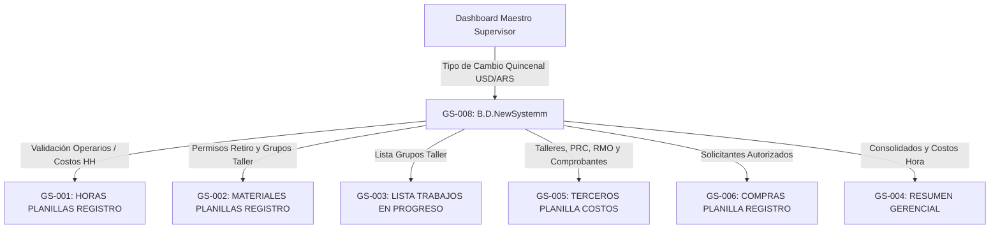

# Mapeo Legacy: B.D.NewSystemm (Base de Datos de Personal, Clasificación y Costos)

> [!IMPORTANT]
> **Fuentes de información cruzadas:** Descripción del usuario (sesiones 2026-08-20 / 2026-08-21), inspección técnica directa vía Google Sheets API (v4), auditoría de fórmulas de celda y cruce con decisiones de producto (`DEC-009` y `DEC-012`).

---

## PARTE A: Diseño Técnico (Para IA / App)

### 1. Clasificación de la Planilla
- **Tipo de Planilla:** TIPO D (Híbrida)
- **Justificación:** Funciona como la base de datos maestra (Master Data) de personas, contratistas, rubros y tarifarios. Combina carga de personal, cálculo automático de tarifarios/conversiones de moneda (`VLOOKUP` e `IMPORTRANGE`), distribución de datos a otros módulos y registro de auditoría (`LOG_CambiosEstadoPersonal`).
> Confianza: CONFIRMADO (Inspeccionado vía API)

### 2. Identidad y Contexto de Negocio
- **ID Planilla:** GS-008
- **Nombre Técnico/Funcional:** BD_NEWSYSTEMM
- **URL / ID:** `https://docs.google.com/spreadsheets/d/1BMgYkKV9WLtaBkbwzgs6xp6X5844Mh8WbMlZaEo3fBo/edit`
- **Departamento Propietario:** Administración / Recursos Humanos / Operaciones
- **Usuarios Principales y Rol:** Liquidador de Sueldos, Administración de Contratistas, Supervisor.
- **Propósito Principal:** Padrón centralizado de operarios propios y externos. Clasifica el personal por grupo de trabajo, rubro y categoría salarial; provee los costos hora hombre (en ARS y USD) y distribuye tablas de validación a todas las planillas del sistema.
- **Frecuencia de Uso:** Carga diaria de altas/bajas/cambios de estado y consulta constante en tiempo real por el resto de los módulos.
- **Integraciones y Cotización Dólar (Evolución a la App):** 
  - *Legacy:* Consumía la cotización USD en celda `G2` mediante `IMPORTRANGE` desde `B.D MATERIALES` (`1LQSPDxbFR-l5Y4XUEDFDCtbXrHYPIukdvOhLBwOdqJk`).
  - *App:* Se reemplaza por el **Dashboard Maestro del Supervisor**, donde el supervisor fijará el tipo de cambio oficial quincena a quincena (al igual que las tarifas hora hombre). Todos los consumos y horas de esa quincena tomarán ese tipo de cambio y se guardará un registro histórico por quincena.
  - Bitácora de cambios en vivo audita modificaciones hacia la pestaña `LOG_CambiosEstadoPersonal`.
> Confianza: CONFIRMADO

---

### 3. Estructura Visual y Navegación
- **Hojas Existentes (4 pestañas):**
  1. `PersonalClasificacionCostos` (TAB-001): Padrón activo y clasificación de costos (173 filas activas, encabezados en Fila 5).
  2. `BaseDatosP/PlanillasRegistro` (TAB-002): Hub de distribución y tablas auxiliares desplegables para Horas, Materiales, Terceros y Compras (57 columnas).
  3. `BD_ValorHoraHombre` (TAB-003): Tarifario base por categoría y contratista en pesos ARS (42 filas).
  4. `LOG_CambiosEstadoPersonal` (TAB-004): Bitácora de cambios de estado (ALTAS, MODIFICACIONES) generada por script (135 filas de log).
> Confianza: CONFIRMADO

---

### 4. Estructura de Datos y Columnas

#### (TAB-001) `PersonalClasificacionCostos`
| Col | Nombre Encabezado | Tipo Dato | Ingreso | Fórmulas / Reglas de Negocio Clave |
|---|---|---|---|---|
| A | `NOMBRE` | String | MANUAL | Apellido, Nombre del operario o registro de máquina/taller. |
| B | `GRUPO DE TRABAJO` | String | FORMULA / MANUAL | `=E6` (Toma el Centro Administrativo o el Taller asignado). |
| C | `U$/HORA` | Currency (USD) | FORMULA | `=I6/$G$2` (Divide valor ARS por el tipo de cambio de la quincena). |
| D | `RUBRO` | Enum | DESPLEGABLE | Raschinaje, Calderería, Carpintería, Mecánica, Mandados, etc. |
| E | `CENTRO ADMINISTRATIVO` | Enum (Array) | DESPLEGABLE MÚLTIPLE | ASTILLERO, CONTRATISTA, TALLER, ASTILLERO ADMINISTRACION. (Admite selección múltiple, ej: ASTILLERO + ASTILLERO ADMINISTRACION). |
| E2| `DEPARTAMENTO` | Enum (Array) | DESPLEGABLE MÚLTIPLE | Pañol, Compras, Logística, Sueldos, RRHH, Contabilidad, Operaciones, Gerencia, Finanzas, Ventas, Supervisión. (Admite selección múltiple). |
| F | `CONSUMIBLES` | Enum | DESPLEGABLE | CLIENTE, CONTRATISTA (Regla % parametrizable en DEC-009). |
| G | `ELEM_SEGURIDAD` | Enum | DESPLEGABLE | CONTRATISTA (100% costo a cargo del contratista). |
| H | `ESTADO` | Enum | DESPLEGABLE | ACTIVO, INACTIVO (Soft Delete para altas/bajas rápidas). |
| I | `AR$/HORA` | Currency (ARS) | FORMULA | `=IF(J6="";"";VLOOKUP(J6;BD_ValorHoraHombre!B$2:C$100;2;FALSE))` |
| J | `CATEGORIA` | Enum | DESPLEGABLE | AYUDANTE, OFICIAL, 1/2 OFICIAL, APRENDIZ, MANDADOS, MISCELANEOS, ADMINISTRATIVO... |
| K | `CARGA MATERIALES` | Boolean | DESPLEGABLE | SI / NO (Permiso para retirar consumibles/materiales en pañol). |
| L | `COSTO HORAS` | Boolean | DESPLEGABLE | SI / NO (Permiso para imputar horas presenciales). |
| M | `CODIGO GRUPO TRABAJO. RUBRO` | String | FORMULA | `=IF(A6="";"";CONCATENATE(B6;".";D6))` (Ej. `ASTILLERO.RASCHINAJE`). |

#### (TAB-003) `BD_ValorHoraHombre`
- **Campos:** `id`, `categoria`, `valor_horaHombre_pesos`.
- **Anomalía / Deuda Técnica:** Mezclaba categorías salariales (`AYUDANTE`, `OFICIAL`) con nombres de talleres (`AVALOS`, `AVALOS AYUDANTE`, `RAMON ARANDA`, `TECO TALLER`, `DAMIAN`) para sortear el `VLOOKUP`.

---

### 5. Mapa Relacional de Dependencias (CRÍTICO)

---

### 6. Requerimientos de Migración a Supabase/n8n

| Pestaña / Concepto Legacy | Entidad Supabase Objetivo | Módulo | Notas de Transformación |
|---|---|---|---|
| Operario Individual | `Worker` | M2-recursos | Guarda Nombre, Apellido, DNI, Estado (Soft Delete). |
| Grupo de Trabajo / Contratista | `Workshop` / `WorkGroup` | M2-recursos | Entidad para imputación directa en Materiales y Terceros. |
| Categorías Salariales | `WorkerCategory` | M2-recursos | Oficial, Medio Oficial, Ayudante, Aprendiz. |
| Tarifario por Quincena | `RateCard` | M2-recursos | Tarifario salarial con vigencia temporalizada por quincena. |
| Cotización Dólar Quincenal | `CurrencyRate` | M6-cierre | Histórico del tipo de cambio fijado en Dashboard Maestro. |
| Audit Log de Cambios | `AuditTrail` | M6-cierre | Log de auditoría automático en PostgreSQL. |

---

## PARTE B: Lógica de Negocio (Para Humanos)

### Propósito y Uso en la Vida Real
`B.D.NewSystemm` es el corazón del padrón operativo del astillero. Nació como una lista imprimible para firmar el ingreso físico en portería. Hoy funciona como la base de datos central que clasifica a cada persona, determina de qué taller proviene, cuánto cuesta su hora de trabajo y qué permisos tiene.

---

### Reglas de Negocio Clave

1. **Reemplazo Biométrico Facial:**
   - La hoja imprimible de firma en portería **queda descartada**.
   - El control de acceso e ingreso físico se realiza mediante lectores biométricos faciales, alimentando directamente el módulo de Asistencia (`Attendance`).

2. **Diferenciación de Imputación: Materiales vs Carga de Horas (Workgroup vs WorkerCategory):**
   - **Módulo de Materiales / Pañol:** El costo de los materiales retirados se imputa **directamente al Grupo de Trabajo / Taller (`Workshop`)**, independientemente del nombre o categoría de la persona que retira el insumo.
   - **Módulo de Carga de Horas:** Se imputa al **Grupo de Trabajo (`Workshop`) + la Categoría del Operario (`WorkerCategory`)**, ya que el costo varía drásticamente según si la hora es de Oficial, Medio Oficial o Ayudante.
   - **Comportamiento en la App (UX Selector):** En la pantalla de carga de horas, al seleccionar un taller/grupo de trabajo (`Workshop`), el selector desplegable filtrará automáticamente y mostrará únicamente las categorías salariales (`WorkerCategory`) activas asignadas a ese taller. Esto garantiza la valuación exacta sin necesidad de crear registros duplicados manuales.

3. **Diferenciación de Contratistas en Terceros: PRC vs RMO (Regla del Sufijo "Taller"):**
   - **Presupuesto (PRC):** Se utiliza cuando la mano de obra del contratista corresponde a **horas o trabajos realizados presencialmente dentro del astillero**.
   - **Remito de Mano de Obra (RMO):** Se utiliza en la planilla de Terceros cuando se trata de un **trabajo ejecutado externamente en el propio taller del contratista**.
   - *Solución UX App:* El asistente didáctico sugerirá crear la cuenta hermana `"Nombre Taller"` para separar la facturación de trabajos externos vía RMO sin interferir con el control de asistencia presencial.

4. **Consumibles vs Elementos de Seguridad (Justificativo de Descuentos):**
   - **Consumibles (Regla DEC-009):** Porcentaje parametrizable (% Cliente vs % Contratista). La porción del cliente se imputa como costo directo de la obra; la porción del contratista genera automáticamente un **Sub-reporte / Resumen de Descuentos a Contratista** para respaldar las retenciones en la liquidación quincenal.
   - **Elementos de Seguridad:** Son **100% a cargo del contratista**. Generan de forma directa el informe de descuento para la administración.

5. **Dashboard Maestro del Supervisor (Tipo de Cambio y Tarifarios Quincenales):**
   - El supervisor fijará el valor del dólar quincena a quincena desde su panel maestro, al igual que los aumentos de tarifas por sindicato para las categorías.
   - Todos los costos y consumos de esa quincena quedarán congelados con dicho tipo de cambio e histórico tarifario, automatizando la liquidación sin tareas de copiar/pegar al cierre de quincena.
