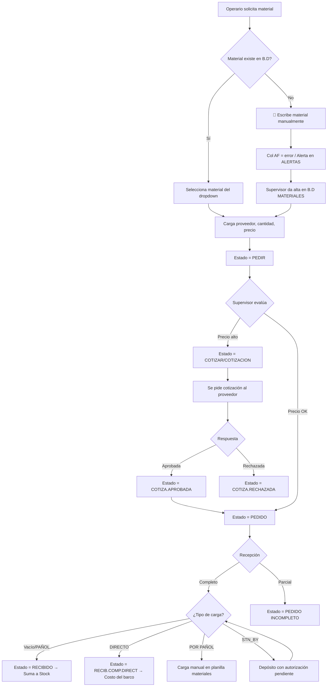
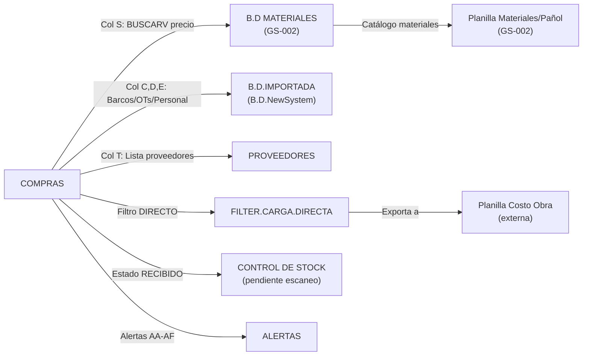

# GS-006 — COMPRAS: Planilla de Registro de Compras

> **Módulo:** M4b — Logística / Compras  
> **Estado:** ✅ Confirmado (Escaneo Profundo)  
> **Spreadsheet ID:** `1k1BBl1pAf8HlGfiNzSt5xGHpkgQw1dD3tWERTYhu3MY`  
> **Última revisión:** 2026-08-20  

---

## 1. Visión General

La planilla de compras es la **puerta de entrada de insumos al astillero**. Cumple funciones críticas:

1. **Registro diario de pedidos de compra** — materiales, cantidades, proveedores, estados
2. **Alimentación del stock** — los materiales recibidos incrementan el inventario (física o virtualmente)
3. **Comparación de precios** — contrasta precio ofrecido por proveedor vs. precio registrado en sistema
4. **Ingreso de materiales nuevos** — materiales sin registro disparan alertas para alta en B.D. Materiales
5. **Estadísticas de proveedores** — frecuencia de compra, rubros, historial de precios
6. **Derivación a costo directo** — materiales comprados para una obra específica se imputan al costo vivo de la OT

---

## 2. Estructura de Hojas

| # | Hoja | GID | Filas | Cols | Rol |
|---|------|-----|-------|------|-----|
| 0 | **ALERTAS** | 262385685 | 26 | 8 | Dashboard de alertas derivadas de COMPRAS (cols AA→AF) |
| 1 | **INDICE** | 979441019 | 16 | 6 | Tablas técnicas de conversión para el encargado de compras |
| 2 | **COMPRAS** | 1198797698 | 40+ | 32 | 🔴 **Hoja principal** — registro diario de compras |
| 3 | **FILTER.CARGA.DIRECTA** | 1342067662 | 9 | 20 | Filtro intermedio de líneas marcadas como "DIRECTO" |
| 4 | **PROVEEDORES** | 1817551402 | 500+ | 9 | Catálogo de proveedores con datos de pago y contacto |
| 5 | **B.D.IMPORTADA** | 794448610 | 239 | 45 | Base importada de OTs, barcos, proveedores y personal autorizado |
| 6 | **B.D MATERIALES** | 995033070 | 500+ | 9 | Base de datos maestra de materiales con precios |

---

## 3. Hoja COMPRAS — Estructura de Columnas

### 3.1 Zona de Resumen (Filas 1-2)

```
Fila 1: [K] COTIZACIONES PENDIENTES: 0    [T] PEDIDOS PENDIENTES: 0
Fila 2: [K] EN REVISION: 0                [T] PEDIDOS INCOMPLETOS: 0    [Z] Fecha actual: 19/8/2026
```

Contadores automáticos calculados con COUNTIF sobre la columna W (Estado del Pedido).

### 3.2 Encabezados (Fila 3) — 32 Columnas

| Col | Letra | Encabezado | Tipo | Descripción |
|-----|-------|------------|------|-------------|
| A | A | **CARGA DIRECTA** | Dropdown | Destino del material: `DIRECTO`, `STN_BY`, `POR PAÑOL`, vacío |
| B | B | **FECHA** | Fecha | Fecha de carga del pedido |
| C | C | **CLIENTE** | Dropdown | Barco/embarcación (desde B.D.IMPORTADA) |
| D | D | **ORDEN TRABAJO** | Dropdown | OT asociada al barco seleccionado (desde B.D.IMPORTADA) |
| E | E | **SOLICITA** | Dropdown | Persona que solicita la compra (desde B.D.IMPORTADA, col "SOLICITA") |
| F | F | **TIPO DE TRABAJO** | Dropdown | Ej: `MATERIALES` |
| G | G | **NORMALES** | — | *(Heredada, sin uso)* |
| H | H | **HORAS AL 50%** | — | *(Heredada, sin uso)* |
| I | I | **HORAS AL 100%** | — | *(Heredada, sin uso)* |
| J | J | **RUBRO** | Dropdown | Rubro del material (desde B.D MATERIALES, col "RUBRO") |
| K | K | **MATERIALE** | Texto/Dropdown | Material a comprar (búsqueda en B.D MATERIALES) |
| L | L | **CANTID** | Número | Cantidad solicitada |
| M | M | **PRECIO/UNI** | Moneda | *(Heredada/sin uso actual)* |
| N | N | **$/U PROVEEDOR** | Moneda/Texto | Precio cotizado por el proveedor (carga manual) |
| O | O | **PESO** | — | *(Heredada, sin uso)* |
| P | P | **CENTRO DE COSTO** | — | *(Heredada, sin uso)* |
| Q | Q | **CATEGORIA** | — | *(Heredada, sin uso)* |
| R | R | **TIPO DE COMPROBANTE** | — | *(Heredada, sin uso)* |
| S | S | **$/U SISTEMA** | Moneda | 🔵 **Fórmula automática** — trae precio de B.D MATERIALES |
| T | T | **PROVEEDOR** | Dropdown | Proveedor seleccionado (desde hoja PROVEEDORES o B.D.IMPORTADA) |
| U | U | **MARCA TEMPORAL** | — | *(Sin uso visible)* |
| V | V | **ENTREGA ESTIMADA** | Fecha | Fecha estimada de entrega |
| W | W | **ESTADO DEL PEDIDO** | Dropdown | Estado actual del pedido (ver sección 3.3) |
| X | X | **CONDICION STOCK** | Dropdown | `STOCK`, `VIRTUAL`, `FALTA INFO` |
| Y | Y | **TIPO.IMPUTACION** | Texto | `PAÑOL`, `DIRECTO` — tipo de imputación |
| Z | Z | **OBSERVACIONES** | Texto libre | Notas del operario/supervisor |
| AA | AA | **DIFERENCIA DE DIAS** | Número | Fórmula: `FECHA_ACTUAL - FECHA_CARGA` (en días) |
| AB | AB | **COTIZACION.VENCIDAS** | Texto | `BIEN`, `VENCIDA`, etc. — estado de vigencia de cotización |
| AC | AC | **TRABAJ. ESPECIAL** | Texto | `N/C` (No corresponde) u otro valor |
| AD | AD | **FALTA CARGA DIRECTA** | Texto | `OK`, `ERROR` — alerta si falta cargar en costo directo |
| AE | AE | **COMPRA DIR. C/RECIBIDO** | Texto | `OK` — compra directa con estado recibido |
| AF | AF | **MATERIAL S/REG./B.DATOS** | Texto | `ok`, `error`, `NO ES NECESARIO` — 🔴 alerta de material sin registro en B.D |

### 3.3 Dropdown: ESTADO DEL PEDIDO (Col W)

| Valor | Significado | Acción / Efecto | Conservar |
|-------|-------------|------------------|-----------|
| `RECIBIDO` | Material recibido en depósito | ✅ Suma al stock físico | ✅ |
| `RECIBIDO 2` | Recibido pero NO computa stock | Material de cliente (ej: panela) | ✅ |
| `RECIB.COMP.DIRECT` | Recibido como compra directa | Se imputa al costo del barco, NO suma stock | ✅ |
| `PEDIDO` | Material pedido al proveedor | Estado normal post-aprobación | ✅ |
| `PEDIDO INCOMPLETO` | Llegó cantidad parcial | Requiere observaciones de lo faltante | ✅ |
| `PEDIR` | Alerta: material listo para pedir | Dispara al encargado de compras | ✅ |
| `COTIZACION` | Se solicita cotización antes de comprar | Supervisor pide comparar precios | ✅ |
| `COTIZAR` | Supervisor pide cotización para evaluar | Similar a COTIZACION | ✅ |
| `COTIZA.SOLICITUD` | Cotización pedida al proveedor, esperando respuesta | En espera | ✅ |
| `COTIZA.APROBADA` | Cotización aprobada | Puede proceder a pedido | ✅ |
| `COTIZA.RECHAZADA` | Cotización rechazada | Buscar alternativa | ✅ |
| `DEVOLUCION` | Material devuelto | — | ✅ |
| `ENVIADO` | Devolución en tránsito | — | ✅ |
| `CANCELADOS` | Compra cancelada | Ya no se requiere | ✅ |
| `SE COMPRA?` | Duda / en averiguación | Pedido posiblemente innecesario | ✅ |
| `NO VENDEN` | Proveedor no vende este producto | Estadística negativa del proveedor | ✅ |
| `3RO.RETIRAR` | Un tercero retira el material | ❌ **No se usa** | ❌ Eliminar |
| `EN REVISION` | En proceso de revisión | ❌ **Duplica "SE COMPRA?"** | ❌ Eliminar |

### 3.4 Dropdown: CARGA DIRECTA (Col A)

| Valor | Significado | Flujo |
|-------|-------------|-------|
| *(vacío)* | Compra estándar para stock/pañol | Material → Stock → Retiro por pañol |
| `DIRECTO` | Compra directa para una obra | Material → Costo directo del barco (no pasa por stock) |
| `STN_BY` | Stand-by en depósito | Material en depósito, requiere autorización para entrega. Luego pasa a DIRECTO o POR PAÑOL |
| `POR PAÑOL` | Se carga por planilla de materiales | Ítems agrupados (ej: "materiales eléctricos varios") con costo manual editado en pañol |

### 3.5 Dropdown: CONDICION STOCK (Col X)

| Valor | Significado |
|-------|-------------|
| `STOCK` | Material computado como stock físico real |
| `VIRTUAL` | Material pedido, aún no recibido — stock virtual (pendiente de recepción) |
| `FALTA INFO` | Información incompleta para clasificar |

---

## 4. Hoja ALERTAS — Dashboard de Compras

Panel de alertas automáticas derivadas de las columnas AA→AF de COMPRAS:

| Alerta | Contador | Origen |
|--------|----------|--------|
| **COMPRAS SIN RECIBIR** | 7 | Filas donde Estado ≠ RECIBIDO y hay pedido activo |
| **COTIZACIONES SIN APROBAR** | 0 | Estado = COTIZACION sin resolución |
| **COTIZACIONES APROBADAS** | 0 | Estado = COTIZA.APROBADA pendientes de pedido |
| **COTIZA. PEDIDAS A PROVEEDORES** | 0 | Estado = COTIZA.SOLICITUD |
| **COTIZACIONES MÁS DE 1 SEMANA** | 0 | Diferencia de días (col AA) > 7 y estado cotización |
| **COTIZACIONES VENCIDAS** | 0 | Col AB = VENCIDA |
| **TRABAJOS EN FABRICACION** | 0 | AC = trabajo especial activo |
| **FALTA CARGA DIRECTA** | 1 | Col AD = ERROR (compra directa sin cargar en costo) |
| **COMPRA DIRECTA CON RECIBIDO** | 0 | Col AE control |
| **MATERIAL S/REG./B.DATOS** | 6 | 🔴 Col AF = "error" → materiales nuevos sin alta en base de datos |
| **COTIZACIONES RECHAZADAS** | 0 | Estado = COTIZA.RECHAZADA |

> [!IMPORTANT]
> La alerta **MATERIAL S/REG./B.DATOS = 6** indica que hay 6 materiales escritos en la hoja COMPRAS que no existen en la B.D MATERIALES. Estos requieren alta manual.

---

## 5. Hoja FILTER.CARGA.DIRECTA

**Propósito:** Filtro intermedio que extrae las líneas de COMPRAS marcadas como `DIRECTO` para exportarlas a la planilla de costos de obra.

### Estructura (20 columnas):

| Col | Encabezado | Origen |
|-----|------------|--------|
| A | COSTO.DIRECTO | Col A COMPRAS |
| B | FECHA | Col B |
| C | CLIENTE | Col C |
| D | ORDEN DE TRABAJO | Col D |
| E | CONTRATISTA | Col E (SOLICITA) |
| F | TIPO DE TRABAJO | Col F |
| G-I | GRUPO/HORAS 50%/100% | Heredados |
| J | RUBRO | Col J |
| K | MATERILAES *(sic)* | Col K |
| L | CANTIDAD | Col L |
| M | PRECIO/UNI US$ | Conversión AR$ → US$ del precio sistema |
| N | COSTO TOTAL US$ | CANTIDAD × PRECIO/UNI US$ |
| O | PESO | — |
| P | CENTRO DE COSTO | Siempre "CLIENTE" |
| Q | CATEGORIA | Siempre "MATERIALES" |
| R | TIPO DE COMPROBANTE | — |
| S | NºFACTURA | — |
| T | OBSERVACIONES | Col Z COMPRAS |

> [!NOTE]
> Esta hoja es un **paso intermedio** que no debería existir en el sistema nuevo. La lógica de filtrado se automatiza directamente.

**Datos actuales:** 8 líneas de compra directa (mayo 2026), incluyendo materiales para barcos ARTESANAL 9 y DON VICENTE VUOSO.

---

## 6. Hoja PROVEEDORES

### Estructura (9 columnas principales + columnas auxiliares)

| Col | Encabezado | Tipo | Valores posibles |
|-----|------------|------|-----------------|
| A | **PROVEEDOR** | Texto | Nombre del proveedor |
| B | **RUBRO** | Texto | *(Incompleto — pendiente de carga)* |
| C | **FACTURACION TARDIA** | Texto | `ALERTA`, vacío |
| D | **MANERA DE PAGO** | Dropdown | `CONTADO`, `CUENTA CORRIENTE` |
| E | **MANERA DE CONTACTO** | Texto | *(Pendiente de carga)* |
| F | **MOMENTO DE FACTURACION** | Dropdown | `DIA`, `INICIO DE MES`, `ALEATORIO` |
| G | **MEDIO DE FACTURACION** | Dropdown | `E-MAIL`, `WHATSAPP`, `EN MANO` |
| H | **OBSERVACIONES** | Texto | Ej: "Transferencia", "PAGO A 7 DIAS", "SIN FACTURA" |
| I | **CONTACTO** | Texto | Datos de contacto |

**Datos actuales:** ~200+ proveedores registrados. Muchos tienen datos parciales (solo nombre). 

> [!WARNING]
> Faltan campos críticos para el sistema nuevo:
> - **RUBRO** está mayoritariamente vacío
> - **MANERA DE CONTACTO** está vacío
> - **CONTACTO** está vacío en la mayoría
> - No existe campo de **CBU/Alias** ni **CUIT/CUIL**

### Columnas auxiliares (cols K-N)
A partir de la columna K hay lo que parece ser una segunda tabla con otros proveedores y productos específicos (ej: bandas modulares, piñones). Esta data está **mezclada** con la tabla principal.

---

## 7. Hoja B.D MATERIALES

### Estructura (9 columnas + columna auxiliar de rubros)

| Col | Encabezado | Tipo | Ejemplo |
|-----|------------|------|---------|
| A | **MATERIALES** | Texto | "ABRAZADERA 1/4x3/4 C/ACCESORIO" |
| B | **COSTO AR$** | Moneda | "$531,12" |
| C | **% SEGURIDAD** | Número | "1,06" (factor multiplicador) |
| D | **COSTO US$** | Moneda | "$0,35" |
| E | **CATEGORIA** | Texto | `MATERIALES`, `CONSUMIBLES`, `ELEM_SEGURIDAD` |
| F | **LOCACION** | Texto | "PAÑOL" o vacío |
| G | **PESO** | Número | Peso en kg (mayormente vacío) |
| H | **RUBRO** | Texto | "ABRAZADERA", "ACCESORIOS", "RODAMIENTOS", etc. |
| I | **MARCA TEMPORAL** | Fecha | "28/5/2025 14:49:54" |

**Parámetros de conversión (Fila 3):**
- Factor de seguridad default: `1,06`
- Tipo de cambio AR$/US$: `$1.500`
- Link: `VER VALOR DOLAR BANCO NACION`

**Columna M (auxiliar): Lista de RUBROS para dropdown en COMPRAS**

Rubros identificados: `RODAMIENTOS`, `INS.MECANICA`, `ABRAZADERA`, `ACCESORIOS`, `ACEITES`, `LIMPIEZA`, `ELECTRICIDAD`, `ACOPLE/ADAPTADOR`, `MOTOR`, `ACC.HIDRAULICA`, `VIDRIOS`, `PINTURA`, `HERRAMIENTAS`, `PEGAMENTO`, `OTROS`, `ACC. PINTURA`, `JUNTAS`, `ACC. ALBAÑILERIA`, `ELECTRODOS`, `ALBAÑILERIA`, `BULONES`, `PERFILES ALUMINIO`, `ANGULOS`, `EQUIPO ESPECIAL`, `ELEM. SEGURIDAD`, `ARANDELAS`, `GASES`, `ACC. CINTAS PESCA`, `MACIZO`, `MADERA`, `HERRAJES`, `FABRICACION`, `BUJE`, `BOMBAS`, `TERMOFUSION`, `BRIDAS`, `BRONCE`, `REDUCCION`, `BURLETES`, `CADENAS`, `GRIFERIA`, `CAÑO`, `CAÑO COBRE`, `CAÑO PVC`, `CAÑO INOX`

**Volumen:** 500+ materiales registrados con precios actualizados (último timestamp: mayo-junio 2025).

---

## 8. Hoja B.D.IMPORTADA

Hoja de datos maestros importados del sistema central. Estructura en **columnas paralelas** (no tabla convencional):

| Columnas | Contenido |
|----------|-----------|
| A→AO (cols 1-41) | **Barcos/Clientes** (41 embarcaciones) con sus respectivas OTs listadas en filas debajo |
| AQ (col 43) | **PROVEEDORES** — lista de proveedores habilitados para dropdown |
| AR (col 44) | **RUBRO** — rubro de cada proveedor |
| AS (col 45) | **SOLICITA** — personas autorizadas a solicitar compras |
| AT (col 46) | **PERSONAL PARA LISTA DE TRABAJOS** — personal para asignación |

### Barcos registrados (41):
`ASTILLERO`, `SAGRARIO`, `MARINA Z`, `REMOLCADOR EDIMIR`, `ARTESANAL 7`, `INCOBRABLES`, `GIULIANA`, `TRITON I`, `ROSA MISTICA`, `DON VICENTE VUOSO`, `SKIPPER`, `SAN CAYETANO`, `RODA`, `CODASTE`, `VIERASA XVII`, `MAR DE ORO`, `REMOLCADOR DUMAR`, `ALTAR`, `RUA DON JOSE`, `LANCHA`, `SILVIA YOLANDA`, `ARESIT`, `KONA`, `CALIZ`, `PESQ. DESEADO`, `ARTESANAL 9`, `ARTESANAL 8`, `ERIN BRUCE`, `PANTOGRAFO`, `DARSENA`, `OPEN SEA`, `RIBAZON INES`, `VIENTO NORTE`, `MAR AUSTRAL`, `REMOLCADOR HURACAN`, `MIRIAM`, `TABEIRON`, `LOBO`, `MANUMAR`, `WIRON`, `CONARA I`

### Proveedores de B.D.IMPORTADA (muestra):
~200 proveedores con rubro asignado (ej: `ALFAMETAL de Hector Orlando Jano → MATERIALES`, `ALON CAR SA → MANUAL`, `CHARRA → CALDERERIA`)

### Personal autorizado a solicitar compras (muestra):
`MANUEL`, `LUIS M`, `ALDO`, `ALBERTO GONZALEZ`, `HUGO`, `ALE CAMADELLI`, `JORGE`, `MARTIN`, `OMAR`, `PABLO N.`, `ROBERTO`, `PAÑOL`, `X(JUSTIFICAR)`, `FABRICACION`, `SABRINA`, `TORNERIA`, y 30+ más.

---

## 9. Hoja INDICE

**Propósito:** Tablas de referencia técnica para el encargado de compras.

| Sección | Contenido |
|---------|-----------|
| **REGISTROS** | Link a bitácora de clientes |
| **TABLAS TÉCNICAS** | Chapas, Tubos ASTM, Macizos, Ángulos, Tabla mm↔pulgadas, Planchuelas, Cadenas c/contrete, Macizos cuadrados, Perfil UPN, Estructuras cuadradas/rectangulares, Chapa galvanizada, Presión tubos ASTM, Tubos inoxidable, Especificaciones técnicas bridas |

> [!NOTE]
> Esta hoja no se accede hace mucho tiempo. Se puede considerar como **información de referencia legacy**. En el sistema nuevo, las tablas técnicas podrían estar en una sección de documentación/ayuda.

---

## 10. Fórmulas y Lógica Clave

### 10.1 Precio del Sistema (Col S)
```
=BUSCARV(K4, 'B.D MATERIALES'!A:B, 2, FALSO)
```
Busca el material en la columna A de B.D MATERIALES y trae el COSTO AR$ (col B). Si no encuentra el material → devuelve error → se marca en col AF como `error`.

### 10.2 Diferencia de Días (Col AA)
```
=HOY() - B4
```
Calcula días transcurridos desde la fecha de carga. Útil para vigencia de cotizaciones.

### 10.3 Cotización Vencida (Col AB)
Lógica condicional:
- Si Estado = COTIZA.* y Diferencia > 7 días → `VENCIDA`
- Si Estado = COTIZA.* y Diferencia ≤ 7 → `BIEN`
- Si no aplica → `N/C`

### 10.4 Material sin Registro (Col AF)
```
=SI(ESERROR(S4), "error", "ok")
```
Si la fórmula BUSCARV en col S falla → el material no existe en B.D MATERIALES → `error`.

### 10.5 Falta Carga Directa (Col AD)
Lógica: Si col A = "DIRECTO" y no se ha cargado en la planilla de costos directos → `ERROR`.

### 10.6 Contadores del Resumen (Filas 1-2)
```
COTIZACIONES PENDIENTES = CONTAR.SI(W:W, "COTIZACION") + CONTAR.SI(W:W, "COTIZAR")
PEDIDOS PENDIENTES = CONTAR.SI(W:W, "PEDIDO") + CONTAR.SI(W:W, "PEDIR")
EN REVISION = CONTAR.SI(W:W, "SE COMPRA?") + CONTAR.SI(W:W, "EN REVISION")
PEDIDOS INCOMPLETOS = CONTAR.SI(W:W, "PEDIDO INCOMPLETO")
```

---

## 11. Flujo de Trabajo Operativo



---

## 12. Problemas Identificados y Soluciones Propuestas

### 12.1 🔴 Alta de Materiales Nuevos (CRÍTICO) — ✅ DECISIÓN TOMADA

**Problema:** Cuando un material no existe en B.D MATERIALES, el operario lo escribe manualmente. El supervisor luego identifica estos materiales (triángulo rojo en Google Sheets) y los copia/pega manualmente a la B.D. Es un proceso tedioso y propenso a errores.

**Solución aprobada:**

#### A) Búsqueda con Autocompletado (todos los roles)
Al escribir en el campo de material, el sistema ofrece **sugerencias en tiempo real** basadas en materiales existentes en la B.D:
- El usuario escribe `bulon` → el sistema sugiere: `BULON ZINCADO 1/2" x 2"`, `BULON ZINCADO 3/8" x 1"`, `BULON INOX 1/4" x 1 1/2"`, etc.
- Esto sirve como **guía de nomenclatura** para que el usuario vea el formato correcto
- Si encuentra lo que busca → lo selecciona y NO es un ítem nuevo
- Si no encuentra → puede escribir un nombre libre → se marca como material nuevo pendiente de alta

#### B) Alta Formal de Material Nuevo (🔒 solo SUPERVISOR)
1. El supervisor ve la alerta de materiales sin registro (col AF / panel ALERTAS)
2. Accede al material pendiente y abre formulario de alta con campos: nombre estandarizado, rubro, categoría, costo AR$, peso, ubicación
3. **Estandarización obligatoria:** El nombre debe seguir convenciones de nomenclatura:
   - Bulones: `BULON [TIPO] [MEDIDA_PULGADAS]" x [LARGO]"` → ej: `BULON ZINCADO 1/2" x 2"`
   - Bulones con dureza especial: nomenclatura de grado (ej: `BULON G8 1/2" x 3"`)
   - Caños: `CAÑO [MATERIAL] [DIAMETRO] x [ESPESOR]`
   - Chapas: `CHAPA [CALIDAD] DE [ESPESOR] (lado x lado) [TRATAMIENTO]`
4. El supervisor aprueba el alta → se agrega a la tabla `materials` con marca temporal y auditoría
5. El campo de la compra se vincula al material recién creado

> [!CAUTION]
> El alta de materiales es una operación de **nivel de seguridad SUPERVISOR** porque impacta directamente en la base de datos maestra. Un material mal nombrado contamina estadísticas, búsquedas y costos de forma permanente.

### 12.2 🟡 Comparación de Precios (MEJORA)

**Problema:** La columna N ($/U Proveedor) permite comparar con col S ($/U Sistema), pero no hay información de:
- % de variación (aumento/disminución)
- Fecha de última actualización del precio en sistema

**Solución aprobada:**
- Agregar un indicador visual automático: ⬆️ +15% | ⬇️ -5%
- Mostrar la fecha de `MARCA TEMPORAL` del material consultado (última actualización de precio)
- **Tooltip en estado COTIZACION:** Al pasar el mouse sobre un estado de pedido que diga "COTIZACION" o similar, mostrar un micro-informe con:
  - Días transcurridos desde que se pidió la cotización
  - Estado de vigencia ("4 días — vigente" / "12 días — ⚠️ vencida")
  - Precio del sistema vs. precio cotizado con % de variación
- **Log de historial de precios** por material (ver sección 17.3)

### 12.3 🟡 Ítems "POR PAÑOL" con Costo Manual — ✅ APROBADA c/restricción

**Problema:** Ítems agrupados (ej: "materiales eléctricos varios") se cargan con costo $0 en la B.D. y el supervisor edita manualmente el precio en la planilla de materiales.

**Solución aprobada (🔒 solo SUPERVISOR):**
- Permitir edición in situ del costo unitario cuando se selecciona la opción `POR PAÑOL`
- Cambiar el flujo: el supervisor carga el costo real → se convierte en `DIRECTO` → entra al sistema normalmente
- Esta edición queda registrada en el log de auditoría (quién editó, cuándo, valor anterior → valor nuevo)

### 12.4 🟡 Columnas Heredadas sin Uso

**Columnas a eliminar:** G (NORMALES), H (HORAS AL 50%), I (HORAS AL 100%), M (PRECIO/UNI redundante), O (PESO), P (CENTRO DE COSTO), Q (CATEGORIA), R (TIPO DE COMPROBANTE)

**Total columnas útiles:** 32 → **24 columnas** (reducción del 25%)

### 12.5 🟡 Permisos de Solicitud

**Pendiente:** Agregar un nuevo permiso en B.D.NewSystem para que un proveedor pueda solicitar materiales en compras (nuevo flag `enabled_purchase_request`).

### 12.6 🔵 Asistente Estadístico para Comprador (NUEVO)

**Problema:** Al momento de comprar un material recurrente, el comprador no sabe rápidamente a quién se lo compró más veces en el pasado, requiriendo análisis manual o memoria.

**Solución aprobada:**
1. Crear el rol **Comprador**, con permisos limitados y específicos para operar esta planilla.
2. Añadir un botón on-demand **"📊 Solicitar Estadística"** junto al material (solo visible si el material ya existe en la B.D.).
3. Al hacer clic, el sistema filtra el historial de `purchase_orders` de ese material donde el estado sea `RECIBIDO` o `RECIB.COMP.DIRECT`.
4. Devuelve un popup ágil con el desglose porcentual de proveedores (ej: *Ferremat 60%, Casa Carlitos 30%, Otros 10%*). Se hace on-demand para no sobrecargar el sistema calculando esto para todas las filas.

### 12.7 🔵 Checkpoint de Revisión de Facturas "Línea Morada" (NUEVO)

**Problema:** El supervisor compara las compras registradas contra las facturas recibidas de los proveedores. Actualmente, pinta de morado la última fila revisada de un proveedor para saber que "de ahí para atrás ya está controlado".

**Solución propuesta:**
Implementar un sistema de **Conciliación de Facturas (Reconciliation)** ágil:
1. En la vista de compras, agrupar o filtrar por Proveedor.
2. Cada fila de compra tendrá un pequeño checkbox o estado visual de **"Conciliado con Factura"**.
3. En lugar de ir uno por uno, el supervisor puede hacer clic derecho sobre una compra específica y seleccionar: **"✅ Conciliar hasta aquí"**.
4. El sistema marca automáticamente esa compra y todas las anteriores de ese proveedor como "Conciliadas" (`is_reconciled = true`).
5. Visualmente, el sistema puede mostrar una línea divisoria gruesa (el equivalente a la "línea morada") debajo de la última compra conciliada de cada proveedor, ocultando por defecto las ya conciliadas para mantener la vista limpia.

---

## 13. Datos Muestra (Hoja COMPRAS — Mayo 2026)

| Fecha | Cliente | OT | Material | Cant | $/U Sistema | Proveedor | Estado | Carga |
|-------|---------|-----|----------|------|-------------|-----------|--------|-------|
| 15/05 | ASTILLERO | STOCK | GAS TUBO X 45KG | 2 | $114.510 | ATLANTICA GAS | RECIBIDO | — |
| 18/05 | ARTESANAL 9 | SALA MAQ | TUERCA AUTOFR 1/2 | 2 | $0 | FERREMAT | RECIB.COMP.DIRECT | DIRECTO |
| 19/05 | ARTESANAL 9 | CUBIERTA | ARENA X MT BOLSON | 1 | $39.644 | CASA CARLITOS | RECIB.COMP.DIRECT | DIRECTO |
| 19/05 | ASTILLERO | STOCK | BATERIA DE OXIGENO | 3 | $814.000 | AIR LIQUIDE | RECIBIDO | — |
| 20/05 | DON V. VUOSO | ADIC. LINEA EJE | BUJE BRONCE POLIURETANO | 0,46 | $3.373.715 | LOTTERI HNOS | PEDIDO | DIRECTO |
| 21/05 | ARTESANAL 9 | ELECTRICIDAD | MAT. ELECTRICOS VARIOS | 1 | $488.554 | CIARDI | PEDIDO | POR PAÑOL |

---

## 14. Mapeo a Entidades del Sistema Nuevo

### Tabla `purchase_orders`

| Campo Sistema | Origen en Sheets | Notas |
|--------------|------------------|-------|
| `id` | Autogenerado | UUID |
| `charge_type` | Col A (CARGA DIRECTA) | ENUM: `DIRECT`, `STANDBY`, `VIA_PANOL`. ⚠️ No existe opción `STOCK`; las compras para stock se identifican por `ship_id` = ASTILLERO + `work_order_id` = STOCK |
| `order_date` | Col B (FECHA) | DATE |
| `ship_id` | Col C → `ships.id` | FK. Cuando es compra para stock: siempre `ASTILLERO` |
| `work_order_id` | Col D → `work_orders.id` | FK. Cuando es compra para stock: siempre `STOCK` |
| `requested_by` | Col E → `workers.id` o texto | FK o texto libre. Cuando es stock: siempre `PAÑOL` |
| `work_type` | Col F | Siempre `MATERIALES`. Es constante porque esta planilla solo registra compras de materiales. Permite agrupar en análisis de OT junto con mano de obra |
| `material_id` | Col K → `materials.id` | FK (nullable si material nuevo pendiente de alta) |
| `material_name_raw` | Col K | Texto original ingresado (se preserva siempre para trazabilidad) |
| `quantity` | Col L | DECIMAL |
| `supplier_quoted_price` | Col N | DECIMAL (nullable) |
| `system_unit_price` | Col S | DECIMAL (calculado de materials) |
| `supplier_id` | Col T → `suppliers.id` | FK |
| `estimated_delivery` | Col V | DATE (nullable) |
| `status` | Col W | ENUM (ver sección 3.3) |
| `stock_condition` | Col X | ENUM: `PHYSICAL`, `VIRTUAL`, `MISSING_INFO` |
| `charge_destination` | Col Y | ENUM: `PANOL`, `DIRECT` |
| `observations` | Col Z | TEXT |
| `days_elapsed` | Calculado | INTEGER (server-side, fecha_actual - order_date) |
| `quote_status` | Col AB | ENUM: `OK`, `EXPIRED`, `NA` |
| `is_new_material` | Col AF | BOOLEAN (derivado de "error") |
| `fortnight_period` | Calculado | TEXT: `YYYY-QN` (ej: `2026-Q1`, `2026-Q2`). Derivado de order_date: días 1-15 = Q1, 16-fin = Q2 |
| `is_reconciled` | Nuevo | BOOLEAN. Reemplaza la "línea morada" de revisión de facturas |
| `reconciled_at` | Nuevo | TIMESTAMP. Cuándo fue conciliado por el supervisor |

### Tabla `suppliers` (ampliada desde PROVEEDORES)

| Campo Sistema | Origen en Sheets | Notas |
|--------------|------------------|-------|
| `id` | Autogenerado | UUID |
| `name` | Col A | TEXT UNIQUE |
| `trade` | Col B (RUBRO) | TEXT o FK a tabla trades |
| `late_billing_alert` | Col C | BOOLEAN |
| `payment_method` | Col D | ENUM: `CASH`, `CREDIT_ACCOUNT` |
| `contact_method` | Col E | ENUM: `EMAIL`, `WHATSAPP`, `PHONE`, `IN_PERSON` |
| `billing_timing` | Col F | ENUM: `SAME_DAY`, `MONTH_START`, `RANDOM` |
| `billing_medium` | Col G | ENUM: `EMAIL`, `WHATSAPP`, `IN_PERSON` |
| `observations` | Col H | TEXT |
| `contact_info` | Col I | TEXT |
| `enabled_purchases` | Nuevo | BOOLEAN — habilitado como proveedor de compras |
| `enabled_third_party` | Existente | BOOLEAN |
| `enabled_hours` | Existente | BOOLEAN |
| `enabled_materials` | Existente | BOOLEAN |

---

## 15. Dependencias con Otras Planillas



---

## 16. Preguntas Abiertas — ✅ RESUELTAS (2026-08-20)

| # | Pregunta | Decisión |
|---|----------|----------|
| 1 | **Control de Stock** — ¿Cuándo escaneamos? | Escanear lo antes posible. Próxima prioridad. |
| 2 | **Proveedores duplicados** — ¿Se unifican? | ✅ Sí. Todo se unifica en una sola tabla `suppliers`. |
| 3 | **Tipo de cambio** — ¿Manual o automático? | Actualización **por quincena** manual. El supervisor configura el tipo de cambio en un panel de parámetros quincenales. Q1 = días 1-15, Q2 = días 16-fin de mes. Todos los datos se orientan a la quincena vigente. |
| 4 | **Historial de precios** — ¿Se necesita? | ✅ Sí. Log obligatorio con: fecha, quién cambió, valor anterior → valor nuevo, motivo. Permite análisis de evolución de precios en el tiempo. Ver sección 17.3. |
| 5 | **POR PAÑOL con costo $0** — ¿Aprobada? | ✅ Aprobada con restricción de seguridad: **solo SUPERVISOR** puede editar costo in situ. Queda en log de auditoría. |

---

## 17. Modelo de Seguridad y Permisos — Compras

> [!IMPORTANT]
> Cada módulo/planilla debe tener su nivel de seguridad definido en la tabla de permisos del sistema. Las acciones sensibles requieren roles específicos.

### 17.1 Matriz de Permisos por Acción

| Acción | Operario / Pañolero | Comprador | Supervisor | Administración |
|--------|:-------------------:|:---------:|:----------:|:--------------:|
| Cargar pedido de compra | ✅ | ✅ | ✅ | ✅ |
| Buscar material (autocompletado) | ✅ | ✅ | ✅ | ✅ |
| Escribir material nuevo (texto libre) | ✅ | ✅ | ✅ | ✅ |
| **Dar alta a material nuevo en B.D** | ❌ | ❌ | ✅ | ✅ |
| Cambiar estado del pedido | ⚠️ Limitado | ✅ | ✅ | ✅ |
| Aprobar/rechazar cotización | ❌ | ❌ | ✅ | ✅ |
| Editar costo POR PAÑOL (in situ) | ❌ | ❌ | ✅ | ✅ |
| Modificar precio en B.D MATERIALES | ❌ | ❌ | ✅ | ✅ |
| Consultar estadística de compras | ❌ | ✅ | ✅ | ✅ |
| Marcar compras como conciliadas | ❌ | ❌ | ✅ | ✅ |
| Ver costos y precios | ❌ Pañolero | ✅ | ✅ | ✅ |
| Configurar tipo de cambio quincenal | ❌ | ❌ | ✅ | ✅ |
| Ver historial de precios | ❌ | ❌ | ✅ | ✅ |
| Administrar proveedores | ❌ | ⚠️ Lectura | ✅ | ✅ |

### 17.2 Estandarización de Nomenclatura de Materiales

El alta de materiales requiere seguir convenciones para mantener la integridad de la base de datos:

| Categoría | Formato | Ejemplo |
|-----------|---------|--------|
| Bulones zincados | `BULON ZINCADO [ancho]" x [largo]"` | `BULON ZINCADO 1/2" x 2"` |
| Bulones con grado | `BULON G[grado] [ancho]" x [largo]"` | `BULON G8 1/2" x 3"` |
| Bulones inox | `BULON INOX [ancho]" x [largo]"` | `BULON INOX 3/8" x 1 1/2"` |
| Tuercas | `TUERCA [TIPO] [medida]` | `TUERCA ZINCADA 7/16" 14 HILOS` |
| Caños | `CAÑO [MATERIAL] [diámetro] x [espesor]` | `CAÑO INOX 2" x 2mm` |
| Chapas | `CHAPA [CALIDAD] DE [espesor] (lado x lado) [TRATAMIENTO]` | `CHAPA NAVAL DE 1/4" (6mm) SIN PINTAR` |
| Abrazaderas | `ABRAZADERA [TIPO] [medida]` | `ABRAZADERA HIERRO Nº 108` |
| Discos | `DISCO [TIPO] GRANO [nº]` | `DISCO LIJA GRANO 36` |

> [!TIP]
> El autocompletado al escribir material sirve como guía de formato: el usuario ve cómo están nombrados materiales similares y replica la convención.

### 17.3 Log de Historial de Precios

Tabla `material_price_log`:

| Campo | Tipo | Descripción |
|-------|------|-------------|
| `id` | UUID | PK |
| `material_id` | FK → materials | Material afectado |
| `previous_price_ars` | DECIMAL | Precio anterior en AR$ |
| `new_price_ars` | DECIMAL | Precio nuevo en AR$ |
| `previous_price_usd` | DECIMAL | Precio anterior en US$ |
| `new_price_usd` | DECIMAL | Precio nuevo en US$ |
| `exchange_rate` | DECIMAL | Tipo de cambio quincenal aplicado |
| `fortnight_period` | TEXT | Quincena: `YYYY-MM-Q1` o `YYYY-MM-Q2` |
| `changed_by` | FK → users | Quién realizó el cambio |
| `changed_at` | TIMESTAMP | Cuándo se realizó |
| `reason` | TEXT | Motivo del cambio (opcional) |
| `source` | ENUM | `MANUAL`, `PURCHASE_UPDATE`, `BULK_IMPORT` |

### 17.4 Parámetros Quincenales del Supervisor

Tabla `fortnight_settings`:

| Campo | Tipo | Descripción |
|-------|------|-------------|
| `id` | UUID | PK |
| `period` | TEXT | `YYYY-MM-Q1` o `YYYY-MM-Q2` |
| `exchange_rate_usd` | DECIMAL | Tipo de cambio AR$/US$ para la quincena |
| `security_factor` | DECIMAL | Factor de seguridad default (ej: 1.06) |
| `set_by` | FK → users | Supervisor que configuró |
| `set_at` | TIMESTAMP | Fecha/hora de configuración |
| `notes` | TEXT | Observaciones del supervisor |

> [!NOTE]
> Los cortes quincenales (Q1: días 1-15, Q2: días 16-fin de mes) aplican a todo el sistema: pagos, liquidaciones, análisis y purificación de datos.
