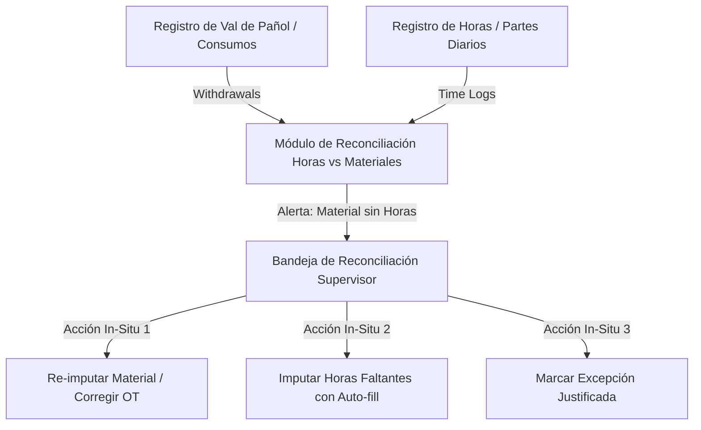

# Mapeo Legacy: Reconciliación de Horas vs Materiales (BD_Nuevas_Planillas & Imputación Horas vs Materiales)

> [!IMPORTANT]
> **Fuentes de información cruzadas:** Descripción del usuario (sesión 2026-08-21), extracción técnica directa vía Google Sheets API (v4) de las planillas `BD_Nuevas_Planillas` (`19akjKRBGHHVw1OwxGhJc71IYFxK5Fd6JeCRpDMaqThs`) e `Imputación horas vs materiales` (`1fpkRbhbeIpykepnRTcJGhgVPOwNhg88qkauWFBU2F3o`), y decisión de producto `DEC-013`.

---

## PARTE A: Diseño Técnico (Para IA / App)

### 1. Clasificación de las Planillas
- **IDs de Planillas:** 
  - `GS-009`: `BD_NUEVAS_PLANILLAS`
  - `GS-010`: `IMPUTACION_HORAS_VS_MATERIALES`
- **Tipo de Planilla:** TIPO D (Híbrida)
- **Justificación:** Son planillas de transformación y auditoría quincenal. Importan retiros de pañol y registros de horas via `IMPORTRANGE`, construyen llaves compuestas de coincidencia y generan una matriz visual de alertas (`AVISO = "NO"`) para detectar fugas de facturación o errores de imputación antes de cerrar la quincena.
> Confianza: CONFIRMADO (Inspeccionado vía API)

---

### 2. Identidad y Contexto de Negocio
- **URL GS-009:** `https://docs.google.com/spreadsheets/d/19akjKRBGHHVw1OwxGhJc71IYFxK5Fd6JeCRpDMaqThs/edit`
- **URL GS-010:** `https://docs.google.com/spreadsheets/d/1fpkRbhbeIpykepnRTcJGhgVPOwNhg88qkauWFBU2F3o/edit`
- **Departamento Propietario:** Operaciones / Administración / Pañol / Supervisión
- **Usuarios Principales y Rol:** Supervisor de Obra, Pañolero, Liquidador de Sueldos.
- **Propósito Principal:** Realizar la auditoría cruzada quincenal previa a la liquidación para garantizar que **todo material retirado de pañol para un Barco y Orden de Trabajo tenga respaldada su respectiva carga de horas de mano de obra**.
- **Frecuencia de Uso:** Cierre quincenal (previo al pago) y revisiones semanales de control.

---

### 3. Estructura Visual y Mecanismo de Alerta Legacy

#### A. Hojas Relevantes Extraídas
1. `ALERTA` (GS-010 - TAB-001): Matriz de coincidencia que compara llaves de Horas vs Materiales por quincena.
2. `IMPORT.MATERIALES` (GS-010 - TAB-002): Importación de vales de pañol con cálculo de quincena y llave compuesta.
3. `IMPORT.HORAS` (GS-010 - TAB-003): Importación de partes diario de horas con cálculo de quincena y llave compuesta.
4. `B.D PERSONAL` (GS-009 - TAB-001): Padrón maestro de personal y permisos.
5. `HORAS.B.D.INTERM.O.T.DESPLEGLABLE` (GS-009 - TAB-002): Matriz de validación Barco/OT para Horas.
6. `TERCEROS.B.D.INTERM.O.T.DESPLEGLABLE` (GS-009 - TAB-003): Matriz de validación Barco/OT para Terceros.
*(Nota: Pestaña `B.D.O.TRABAJO` desestimada por estar en proceso de reemplazo por arquitectura relacional).*

#### B. Construcción de Llave Compuesta de Coincidencia
Tanto en `IMPORT.MATERIALES` como en `IMPORT.HORAS`, el sistema genera una columna `CODIGO` que concatena 4 dimensiones clave:
```excel
=CONCATENATE(N4; "/"; G4; "."; H4; "."; I4)
```
- **Formato:** `[QUINCENA]/[BARCO].[ORDEN DE TRABAJO].[CONTRATISTA]`
- **Ejemplo Real Extraído:** `2DA ago 2026/DON VICENTE VUOSO.ALARGUE MODIFICACION.RAMON ARANDA`

#### C. Lógica de Alerta en Hoja `ALERTA`
- **Columna A (`CODIGO HORAS`):** Lista única de códigos con horas registradas en la quincena (`=UNIQUE(FILTER(...))`).
- **Columna B (`CODIGO MATERIALES`):** Lista de códigos con retiros de materiales en la quincena.
- **Columna C (`ALERTA`):** Inserta un `VLOOKUP` para verificar si la llave del material existe en las horas:
  ```excel
  =IF(B4=""; ""; IFERROR(VLOOKUP(B4; $A$4:$A$9009; 1; FALSE)))
  ```
- **Columna D (`AVISO`):** Muestra **`"NO"`** si la llave de material no tiene correspondencia en horas (`=IF(C4=B4; "OK"; "NO")`).

#### D. Filtros Excluyentes Legacy vs Regla Integral en la App
- **En la Planilla Legacy:** La hoja `IMPORT.MATERIALES` contenía un filtro duro manual (`FILTER(A4:D; D4:D<>"ARMADOR"; D4:D<>"LESIN S.A"; ...)`) para excluir consumibles generales o talleres sin control presencial porque no se disponía de un mecanismo limpio para cruzarlos en Google Sheets.
- **En la App (Regla Unificada DEC-013):** Se elimina el filtro excluyente hardcodeado. Todo taller o entidad (propia, contratista o servicio externo) que retire material de pañol para un Barco/OT debe contar con un **trabajo asignado/reportado** o **horas imputadas**. Si no existe respaldo, el sistema emite una **Alerta de Retiro de Material sin Trabajo Asignado**.

---

### 4. Mapa Relacional de Dependencias



---

## PARTE B: Lógica de Negocio (Para Humanos)

### Propósito y Uso en la Vida Real
Al final de cada quincena (antes de liquidar sueldos y facturar a contratistas), el supervisor debe garantizar que no existan **fugas de información**. Si un taller o contratista retiró discos de corte, electrodos o tuberías para un barco y orden de trabajo específica, es indispensable que existan horas de trabajo registradas para esa tarea. Si un contratista retiró material pero no cargó horas, representa un costo de material entregado sin control de mano de obra.

### El Dolor Legacy: "El Baile entre Planillas"
Actualmente, resolver una alerta `AVISO = "NO"` requiere un proceso manual tedioso:
1. El supervisor filtra la columna `AVISO` por `"NO"` en la pestaña `ALERTA`.
2. Copia la llave del error (ej. `DON VICENTE VUOSO.PROA MODIFICACION.RAMON ARANDA`).
3. Abre la planilla de Materiales de la quincena, busca al contratista y revisa qué insumo retiró para ver si fue un error de tipeo del pañolero.
4. Si duda, abre la planilla de Horas de la quincena para revisar qué tareas reportó el contratista ese día.
5. Edita manualmente las celdas en las distintas planillas y regresa a la hoja `ALERTA` a verificar que el aviso cambie a `"OK"`.

### La Solución en la App (Panel de Reconciliación e Imputación In-Situ)
La App reemplazará por completo las planillas de cruce mediante una **Bandeja de Reconciliación Automática en Tiempo Real**:

1. **Conciliación Relacional Automática:** El backend (Supabase) cruza constantemente los retiros de pañol (`Consumption`) contra la carga de horas (`TimeImput`) y las asignaciones de trabajo (`WorkOrder`).
2. **Alertas Clarificadas:** Se despliegan tarjetas de inconsistencia etiquetadas como **`⚠️ Material sin Carga de Horas / Trabajo Reportado`**.
3. **Resolución en un Clic (In-Place Editing):**
   - **Asistencia Contextual (Vista Rápida):** El sistema asiste al supervisor mostrando las horas que SÍ cargó ese operario/taller en esa semana, brindando contexto inmediato para descubrir si hubo un error de tipeo en la OT sin ir a buscar a otra planilla.
   - **Boton ✏️ Corregir Imputación de Material:** Permite corregir la OT o el Barco del retiro de pañol desde la misma pantalla en caso de error del pañolero.
   - **Boton ➕ Cargar Horas Faltantes:** Abre el formulario de carga de horas con el Barco, OT, Taller y Fecha **pre-completados automáticamente**.
   - **Boton 🛡️ Excepción Justificada:** Permite autorizar retiros especiales sin horas adjuntando una justificación breve.
