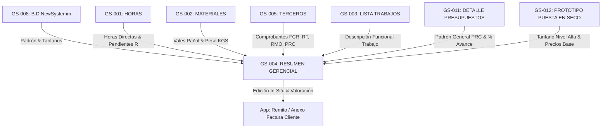

# Mapeo Legacy: Resumen Gerencial & Remitos de Cobro al Cliente

> [!IMPORTANT]
> **Fuentes de información cruzadas:** Descripción del usuario (sesiones 2026-08-20 / 2026-08-21), inspección técnica directa vía Google Sheets API (v4) de las planillas `Resumen Gerencial` (`106QJ8vzUH9c2kRiL7a6vmNPkL2KgfEMwtjsT51Evefw`), `DETALLE DE PRESUPUESTOS` (`1hUPr8ZQNdaDhuzRnIjAtDjfN0pGcOvmcKqsOD77FLu4`), `LISTA TRABAJOS EN PROGRESO` (`GS-003`), `Copia de PROTOTIPO MODELO BARCO HASTA30m` (`10OUtQqL2q2dM-F4YMeJm7P0es_-4Jl0acvsHHmaa0OM`) y la decisión `DEC-014`.

---

## PARTE A: Diseño Técnico (Para IA / App)

### 1. Clasificación de las Planillas
- **IDs de Planillas:** 
  - `GS-004`: `RESUMEN_GERENCIAL`
  - `GS-011`: `DETALLE_DE_PRESUPUESTOS`
  - `GS-012`: `PROTOTIPO_MODELO_PUESTA_EN_SECO`
- **Tipo de Planilla:** TIPO C (Salida / Dashboard Ejecutivo) y TIPO D (Híbrida de transformación).
> Confianza: CONFIRMADO (Inspeccionado vía API)

---

### 2. Identidad y Contexto de Negocio
- **URL GS-004:** `https://docs.google.com/spreadsheets/d/106QJ8vzUH9c2kRiL7a6vmNPkL2KgfEMwtjsT51Evefw/edit`
- **URL GS-011:** `https://docs.google.com/spreadsheets/d/1hUPr8ZQNdaDhuzRnIjAtDjfN0pGcOvmcKqsOD77FLu4/edit`
- **URL GS-012:** `https://docs.google.com/spreadsheets/d/10OUtQqL2q2dM-F4YMeJm7P0es_-4Jl0acvsHHmaa0OM/edit`
- **Departamento Propietario:** Dirección General / Gerencia de Operaciones / Jefatura de Obra / Facturación.
- **Usuarios Principales y Roles:** 
  - *Gerente General (Acceso Nivel Alfa):* Revisa costos globales, modifica tarifas base del tarifario maestro, determina precios de venta, valoriza trabajos in-situ, aprueba el Remito Comercial y monitorea márgenes globales de obra.
  - *Jefe de Obra / Supervisor:* Revisa avances por OT, materiales consumidos, kilos instalados, completa los inputs operativos (días, $m^3$, válvulas, flags) e históricos de trabajos.

---

### 3. Estructura Visual y Navegación Extraída

#### Hojas Clave Identificadas:
1. `RESUMEN` (GS-004 - TAB-001): Dashboard principal con selectores `CLIENTE` (B4) y `ORDEN TRABAJO` (C4).
2. `CALC.GENERALES` (GS-004 - TAB-002): Motor de cálculo que acumula Materiales, Consumibles, Terceros, Horas, Horas Pendientes ("R") y Kilos para la obra completa.
3. `CALC.O.T` (GS-004 - TAB-003): Motor de cálculo filtrado exclusivamente para la OT seleccionada.
4. `DETALLE DE PRESUPUESTOS` (GS-011 - TAB-001): Padrón global de contratos PRC con métricas de avance, horas estimadas y peso.
5. `import.ListaDeTrabajos` (GS-004 - TAB-004): Importación cruzada desde `LISTA_TRABAJOS_EN_PROGRESO` (`GS-003`) que trae la **Descripción Funcional del Trabajo**.
6. `Copia de PROTOTIPO MODELO BARCO HASTA30m` (GS-012 - TAB-001): Modelo estandarizado de cobro para puestas en seco con indicadores técnicos y precios unitarios base.

---

### 4. Mapa Relacional de Dependencias



---

### 5. Requerimientos de Migración a Supabase/n8n

| Concepto Legacy | Entidad Supabase Objetivo | Módulo | Notas de Transformación |
|---|---|---|---|
| Tarifario Gerencial Nivel Alfa | `DrydockRateCard` | M2-recursos | Catálogo maestro de descripciones textuales y precios unitarios base para Puesta en Seco (Editables **solo por Nivel Alfa**). Documentado en `docs/03_negocio/tarifario_puesta_en_seco_alfa.md`. |
| Plantilla de Cobro | `BillingTemplate` | M5-comercial | Plantilla Puesta en Seco (hasta 30m) vs Prototipo Básico Aflote. |
| Inputs Cuantitativos de Obra | `WorkItemMetric` | M3-operaciones | Días, Horas, Metros Cúbicos ($m^3$), Válvulas, Ánodos de Zinc, Flags `1/0`. |
| Comprobantes Terceros | `ThirdPartyInvoice` | M3-operaciones | Soporta todo tipo de comprobante (FCR, RT, RPF, RMO, PRC). |
| Remito Final al Cliente | `InvoiceAttachment` | M5-comercial | Remito oficial consolidado de cobro generado al cliente armador. |

---

## PARTE B: Lógica de Negocio (Para Humanos)

### Propósito y Uso en la Vida Real
El Resumen Gerencial es el tablero maestro del astillero. Se utiliza para monitorear el estado económico y técnico de las obras y **preparar el Remito Comercial / Anexo de Factura al cliente**. El gerente lo usa para cruzar los costos reales cargados con la descripción del trabajo, definir el precio de venta al cliente (desglosado en Mano de Obra y Materiales por cuestiones de IVA) y consolidar el remito global.

---

### Reglas de Negocio Clave

#### 1. Unificación en Pantalla Única (Costo Interno Incurrido vs Remito Comercial):
- **Eliminación del Pimpón de Idas y Vueltas:** En lugar de navegar entre la planilla de costos internos (`CALC.GENERALES`/`CALC.O.T`) y la redacción del remito comercial, la App unifica ambos aspectos en una sola vista dividida:
  - **Panel Izquierdo (Costo Interno Real):** Muestra automáticamente los costos incurridos de Materiales, Consumibles, Horas Directas, Terceros y Peso (KG) calculados para la OT.
  - **Panel Derecho (Redacción Comercial del Remito):** Muestra las descripciones textuales literales pre-cargadas desde la plantilla seleccionada, con sus **tarifas unitarias fijas** y los **campos cuantitativos abiertos para carga operativa**.

#### 2. Tarifario Maestro Gerencial (Nivel de Acceso Nivel Alfa):
- **Catálogo Estandarizado de Puesta en Seco (`DrydockRateCard`):**
  - Contiene las descripciones textuales exactas e inalterables de las tareas tabuladas (ej. *"Maniobra de halaje y botadura con anguilera"*, *"Estadía en varadero. Por día."*, *"Sondajes ultrasónicos en casco..."*), junto con sus **Precios Unitarios Base en USD**. Documentado y tabulado en [`docs/03_negocio/tarifario_puesta_en_seco_alfa.md`](file:///c:/Users/senti/.gemini/antigravity/scratch/App_AlonCar/docs/03_negocio/tarifario_puesta_en_seco_alfa.md).
- **Seguridad Nivel Alfa (Gerencial Superior):**
  - **Únicamente el Gerente General (Nivel Alfa)** tiene permiso para ingresar a este tarifario maestro y modificar los precios unitarios base.
  - Los Supervisores y Jefes de Obra **no pueden alterar los precios unitarios base del tarifario**, solo pueden cargar las cantidades físicas ejecutadas.

#### 3. Distinción Estricta: Campos Fijos Pre-cargados vs Campos Abiertos para Carga Operativa:
Al seleccionar la **Plantilla Puesta en Seco (Barco hasta 30m)**, el sistema autocompleta la estructura y distingue claramente:
- **🔒 Campos Fijos (Autocompletados desde el Tarifario Nivel Alfa):** Descripciones textuales literales exactas, Precios Unitarios USD base y leyendas de recargos (maniobra nocturna 25%, día inhábil 35%).
- **✏️ Campos Abiertos para Carga Operativa (Inputs Cuantitativos de Obra):**
  - Cantidades / Días / Horas (días de varadero, días de muelle, horas de grúa).
  - Mecánica Naval: Checkboxes / Flags `1` o `0` para tareas realizadas (ej. desarme/armado de guardacabos, romper/reponer cemento de platina).
  - Tanques: Metros cúbicos ($m^3$) de cada tanque.
  - Válvulas de Casco: Cantidad de válvulas recorridas.
  - Protección Galvánica: Cantidad de recambios de ánodos de zinc.
  - Sondajes Ultrasónicos: Cantidad de puntos de medición adicionales.

#### 4. Modalidad Aflote / Prototipo Básico (Escritura Libre):
- Si la obra no requiere puesta en seco (trabajos en el agua, reparaciones de muelle o piezas de taller enviadas al cliente), se selecciona el **Prototipo Básico**, el cual habilita un formato de **escritura libre** (descripción abierta, cantidad, precio unitario USD, IVA si/no).

#### 5. Resumen Acumulado Comercial & Margen Global de Obra:
- Conforme se completan las cantidades en las OTs, la cabecera comercial autocalcula:
  * `Total Exento ($ USD)`
  * `Total Gravado ($ USD)`
  * `I.V.A. (21%) ($ USD)`
  * `TOTAL REMITO A COBRAR ($ USD)`
  * `MARGEN GLOBAL REAL DE OBRA ($ USD y %)` (Equilibrando OTs de bajo margen con OTs de alto margen)
- **Emisión en 1 Clic:** Botón para generar el PDF/Excel oficial idéntico al formato legacy para presentar al cliente armador.

---

### 6. Comparador Interactivo de Obras (Ship Comparison Canvas)

> [!IMPORTANT]
> **Extensión del Resumen Gerencial (GS-004).** Esta funcionalidad expande las capacidades analíticas del resumen gerencial agregando comparación cruzada entre obras. Toda la data que alimenta este comparador proviene de las mismas fuentes que ya alimentan el GS-004 (ver Sección 4 - Mapa Relacional).

#### 6.1. Problema que Resuelve
Al tener múltiples barcos con trabajos similares (ej: 3 barcos con cubiertas de madera realizadas por distintos talleres), la comparación se hace manualmente abriendo cada resumen por separado, copiando números y haciendo cuentas. Esto es lento, tedioso y propenso a error.

#### 6.2. Layout de la Interfaz (3 Paneles)

El flujo visual es de **izquierda a derecha** (estilo panel de Zoho). El usuario arrastra elementos desde los paneles laterales izquierdos hacia el canvas de resultados a la derecha.

```
  ☐ Obras activas  ☐ Histórico  ☐ Mixto
┌──────────────────┬───────────────────┬──────────────────────────────────────┐
│  PANEL B: BARCOS │  PANEL C: OTs     │                                      │
│ ──────────────── │ ────────────────  │                                      │
│  🚢 Libertad     │  (Se actualiza    │         PANEL A: CANVAS              │
│  🚢 Espadarte    │   dinámicamente)  │         (Área principal de           │
│  🚢 Miriam       │                   │          comparación y resultados)   │
│  🚢 Tabeirón     │  🔧 Cubierta mad. │                                      │
│  ...             │  🔧 Pintura casco │         Drag & Drop aquí ──────►     │
│                  │  🔧 Mecánica nav. │         para generar comparativas    │
│  (Se actualiza   │  ...              │                                      │
│   dinámicamente) │                   │                                      │
└──────────────────┴───────────────────┴──────────────────────────────────────┘
```

- **Panel B (Barcos):** Columna izquierda. Muestra los nombres de barcos disponibles. Ancho adaptado al nombre más largo. Se actualiza dinámicamente si se arrastra primero una OT.
- **Panel C (OTs):** Columna central. Muestra las OTs disponibles. Se actualiza dinámicamente en función de los barcos arrastrados al canvas.
- **Panel A (Canvas):** Ocupa la proporción más grande de la pantalla (zona derecha). Es el área donde se muestran los resultados de la comparación (tablas, gráficos).
- **Selector de Alcance Temporal:** Ubicado en la parte superior, por encima de los tres paneles (ver 6.4).

#### 6.3. Filtro Cruzado Bidireccional (Drag & Drop)

El mecanismo de filtro funciona en ambos sentidos:

**Sentido Barco → OT:**
1. El usuario arrastra **Barco A** al canvas → Panel C muestra todas las OTs de Barco A.
2. Arrastra **Barco B** → Panel C se filtra y muestra solo las OTs **que comparten** A y B.
3. Arrastra **Barco C** → Panel C se filtra y muestra solo las OTs **que comparten** A, B y C.

**Sentido OT → Barco:**
1. El usuario arrastra **OT "Cubierta de madera"** al canvas → Panel B resalta solo los barcos que tienen esa OT.
2. Arrastra otra OT → Panel B se filtra a los barcos que comparten ambas OTs.

#### 6.4. Selector de Alcance Temporal

En la parte superior del Panel B, un selector tipo radio/check determina qué barcos se listan:

- **Obras Activas:** Solo barcos con obras en progreso (estado no facturado/cerrado).
- **Histórico:** Barcos con obras ya cerradas y facturadas. Los nombres se cargan según la lógica de almacenamiento histórico del módulo M6 (requiere validar cómo se archivan los nombres de obra para mostrarlos correctamente).
- **Mixto:** Combina ambas listas, permitiendo comparar una obra en curso contra una histórica del mismo u otro barco.

> [!NOTE]
> La implementación del modo "Histórico" y "Mixto" depende de la definición final de la entidad `HistoricalData` del módulo M6-cierre. Al momento de implementar, revisar cómo se almacenan los identificadores de obra para garantizar que los nombres se resuelvan correctamente.

#### 6.5. Comparación Nivel 1: Vista General por Costos

Al arrastrar barcos al canvas, se genera automáticamente una tabla comparativa **exclusivamente en costos (dinero)**:

| Concepto | Barco A | Barco B | Barco C |
|---|---|---|---|
| **Costo Total Obra** | $45.000 | $52.000 | $38.000 |
| **Costo de Horas** | $25.000 | $29.000 | $17.500 |
| **Costo Materiales** | $12.000 | $18.000 | $9.500 |
| **Costo Terceros** | $8.000 | $5.000 | $11.000 |
| **OTs en común** | 5 de 8 | 5 de 12 | 5 de 6 |

> [!IMPORTANT]
> **Aclaración terminológica:** "Costo de Horas" se refiere exclusivamente al costo derivado de las horas trabajadas (imputación × tarifa). NO es sinónimo de "Mano de Obra", ya que Mano de Obra = Horas + Terceros. Cada fila de costo total se muestra por separado (Horas, Materiales, Terceros).

##### 6.5.1. Tooltip de Desglose por Rubro (Hover)

Cuando el usuario acerca el puntero a **cualquier valor de costo total** en la tabla, aparece una ventana emergente (tooltip) con el desglose agrupado por rubro y su porcentaje. Esto aplica a todos los costos (Horas, Materiales, Terceros). Es una miniatura de lo que muestra la hoja CALC.GENERALES / CALC.O.T.

**Ejemplo:** Hover sobre "Costo de Horas: $25.000" del Barco A:

```
┌─────────────────────────────────┐
│  Desglose por Rubro             │
│ ─────────────────────────────── │
│  Raschinaje    $10.000    40%   │
│  Calderería    $12.500    50%   │
│  Mecánica       $2.500    10%   │
│ ─────────────────────────────── │
│  Total         $25.000   100%   │
└─────────────────────────────────┘
```

Los valores se muestran alineados en columnas (nombre del rubro, monto, porcentaje) para facilitar la lectura rápida. Este comportamiento aplica a **todas las filas de costo** de la tabla, no solo a Horas.

> [!NOTE]
> **Las horas NO se muestran como valor suelto en la tabla principal.** Comparar horas brutas entre obras de distinto tamaño no tiene sentido analítico. El análisis de horas solo tiene valor cuando se desglosa **por rubro** y se cruza con otras variables (KG, costo, contratista). Esto se hace en el Nivel 2 (drill-down por OT).

#### 6.6. Comparación Nivel 2: Drill-Down por OT

Cuando el usuario arrastra una OT compartida al canvas, se despliega el análisis detallado para esa OT específica, cruzando datos de las planillas de Horas (GS-001), Materiales (GS-002) y Terceros (GS-005).

##### 6.6.1. Datos disponibles para el análisis por OT:

- **Costos directos** (horas, materiales, terceros) por barco para esa OT.
- **KG instalados** (dato que sí se captura en GS-002 y GS-004).
- **Contratista/Taller** que ejecutó el trabajo.
- **Modalidad de contratación:** Determinar si el contratista trabajó **por hora** o **por presupuesto cerrado** (esto se infiere de cómo están cargadas las horas del contratista en la planilla).
- **Observaciones de Terceros:** Los comentarios de la planilla de Terceros (GS-005) se traen como texto de referencia, ya que pueden contener datos cuantitativos no estructurados (ej: "45 m² de cubierta", "3 válvulas recorridas") que el usuario puede leer para contextualizar la comparación.

> [!NOTE]
> **Datos como metros cuadrados (m²) no se capturan de forma estructurada** en las planillas actuales. Pueden aparecer escritos en las observaciones de la planilla de Terceros. El sistema trae esos comentarios como texto de referencia, pero no puede calcular automáticamente ratios como $/m². Si en el futuro se decide capturar m² como campo estructurado, este análisis se puede extender.

##### 6.6.2. Análisis de Productividad por Contratista

El comparador permite evaluar la productividad de los talleres cruzando las siguientes variables:

**Análisis A: Horas vs KG vs Contratista** (para trabajos contratados por hora)
- Compara cuántas horas necesitó cada taller para instalar la misma cantidad de KG.
- Útil para evaluar eficiencia operativa.

**Análisis B: Costo Presupuesto vs KG vs Contratista** (para trabajos contratados por presupuesto cerrado)
- Compara el costo del presupuesto cerrado de cada taller normalizado por KG instalados.
- Útil para evaluar competitividad comercial.

> [!IMPORTANT]
> **Distinción clave para el cálculo:** El sistema debe verificar si las horas del contratista para esa OT están cargadas como **modalidad "por hora"** o como **modalidad "presupuesto cerrado"**. Esto determina qué análisis (A o B) aplica. Si la modalidad es mixta o no está clara, el sistema debe señalarlo como advertencia para que el usuario interprete los datos con criterio.

##### 6.6.3. Ejemplo de tabla Nivel 2 (OT: Cubierta de Madera)

| Detalle | Barco A | Barco B | Barco C |
|---|---|---|---|
| **Taller** | Taller X | Taller Y | Taller X |
| **Modalidad** | Por hora | Presupuesto | Por hora |
| **Costo Total OT** | $15.000 | $22.000 | $12.500 |
| **Costo Presupuesto (Terceros)** | — | $22.000 | — |
| **Horas Registradas** | 80 hs | 95 hs | 65 hs |
| **KG Instalados** | 850 kg | 1.200 kg | 720 kg |
| **Costo / KG** | $17,6/kg | $18,3/kg | $17,4/kg |
| **KG / Hora** | 10,6 kg/h | 12,6 kg/h | 11,1 kg/h |
| **Observaciones Terceros** | *"Madera lapacho 45m²"* | *"Cubierta completa proa-popa 62m²"* | *"Reemplazo parcial 38m²"* |

> [!IMPORTANT]
> **Horas en modalidad Presupuesto:** Cuando un taller trabaja por presupuesto cerrado, el costo del presupuesto se carga en la planilla de Terceros (GS-005). Sin embargo, las horas trabajadas día a día **sí se registran** en la planilla de Horas (GS-001) con la marca "presupuesto" en la columna F. El comparador muestra **ambos datos**: el costo del presupuesto (fila "Costo Presupuesto") y las horas efectivamente registradas (fila "Horas Registradas"). Esto permite calcular la productividad real (KG/Hora) incluso para contratos por presupuesto, dato clave para evaluar la eficiencia del taller independientemente de su modalidad de cobro.

#### 6.7. Acciones Disponibles en el Canvas

- **Guardar Vista:** Almacena la configuración exacta de la comparación (barcos seleccionados, OTs, filtros) como "Vista Favorita" para acceso rápido (según lo definido en el Módulo 7 de Analítica del ROADMAP_NEGOCIO.md).
- **Exportar:** Genera Excel/PDF con la comparativa tal como se ve en pantalla.
- **Limpiar Canvas:** Remueve todos los elementos arrastrados y resetea los filtros cruzados.

#### 6.8. Métricas Ad-Hoc: Patrón de Referencia Manual

Hay datos que el gerente conoce pero que no están capturados de forma estructurada en las planillas (ej: metros cuadrados de una cubierta, cantidad de caños soldados, metros lineales de cordón). Para no perder esa capacidad analítica, el comparador permite **inyectar valores de referencia temporales** que el sistema usa para calcular ratios comparativos sobre la marcha.

##### 6.8.1. Cómo Funciona

1. En la tabla de Nivel 2 (drill-down por OT), aparece un botón **"+ Agregar Métrica"**.
2. El gerente hace clic y se habilita una **fila nueva editable** en la tabla.
3. Completa:
   - **Nombre de la métrica:** (texto libre, ej: "m² cubierta")
   - **Unidad:** (texto libre, ej: "m²")
   - **Valor por cada barco:** (numérico, ej: 45, 62, 38)
4. Al confirmar, el sistema **recalcula automáticamente** nuevas filas derivadas:
   - `Costo / [unidad]` (ej: $/m²)
   - `Horas / [unidad]` (si aplica según modalidad)
   - `KG / [unidad]` (si hay KG cargados)

##### 6.8.2. Ejemplo Visual

El gerente sabe que las cubiertas miden 45m², 62m² y 38m² respectivamente. Agrega la métrica "m² cubierta" y la tabla se extiende automáticamente:

| Detalle | Barco A | Barco B | Barco C |
|---|---|---|---|
| **Taller** | Taller X | Taller Y | Taller X |
| **Costo Total OT** | $15.000 | $22.000 | $12.500 |
| **KG Instalados** | 850 kg | 1.200 kg | 720 kg |
| ── *Métrica manual* ── | | | |
| **📐 m² cubierta** | 45 | 62 | 38 |
| **Costo / m²** | *$333/m²* | *$354/m²* | *$329/m²* |
| **KG / m²** | *18,9 kg/m²* | *19,4 kg/m²* | *18,9 kg/m²* |
| **Horas / m² (si aplica)** | *1,78 hs/m²* | — | *1,71 hs/m²* |

Las filas calculadas automáticamente se distinguen visualmente (ej: texto en itálica o color diferente) para que quede claro que son derivadas de un dato ingresado manualmente.

##### 6.8.3. Persistencia de las Métricas Ad-Hoc

- **Temporal por defecto:** La métrica vive solo en la sesión del canvas. Si el usuario limpia el canvas o cierra, desaparece.
- **Guardable con la Vista:** Si el usuario usa "Guardar Vista" (sección 6.7), las métricas ad-hoc se persisten junto con la configuración de la vista, para que la próxima vez que la abra ya estén cargadas.
- **No contamina la base de datos operativa:** Estos valores nunca se escriben en las planillas originales (GS-001, GS-002, GS-005). Viven exclusivamente en el contexto analítico del comparador.

> [!NOTE]
> **Evolución futura:** Si una métrica ad-hoc se usa repetidamente (ej: m² aparece en todas las comparaciones de cubiertas), eso es una señal de que conviene promoverla a **campo estructurado** en la planilla de Terceros o en la OT. El sistema podría detectar este patrón y sugerirlo.
