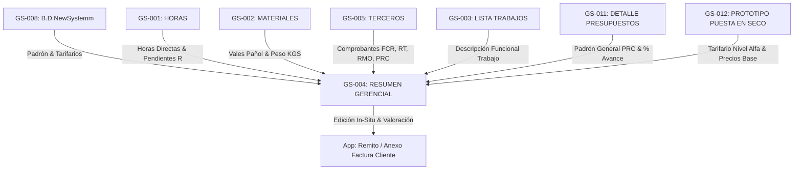

# Mapeo Legacy: Resumen Gerencial & Remitos de Cobro al Cliente

> [!IMPORTANT]
> **Fuentes de información cruzadas:** Descripción del usuario (sesiones 2026-08-20 / 2026-08-21), inspección técnica directa vía Google Sheets API (v4) de las planillas `Resumen Gerencial` (`106QJ8vzUH9c2kRiL7a6vmNPkL2KgfEMwtjsT51Evefw`), `DETALLE DE PRESUPUESTOS` (`1hUPr8ZQNdaDhuzRnIjAtDjfN0pGcOvmcKqsOD77FLu4`), `LISTA TRABAJOS EN PROGRESO` (`GS-003`), `Copia de PROTOTIPO MODELO BARCO HASTA30m` (`10OUtQqL2q2dM-F4YMeJm7P0es_-4Jl0acvsHHmaa0OM`) y la decisión `DEC-014`.

---

## PARTE A: Diseño Técnico (Para IA / App)

### 1. Clasificación de las Planillas
- **IDs de Planillas:** 
  - `GS-004`: `RESUMEN_GERENCIAL`
  - `GS-011`: `DETALLE_DE_PRESUPUESTOS`
  - `GS-012`: `PROTOTIPO_MODELO_PUESTA_EN_SECO`
- **Tipo de Planilla:** TIPO C (Salida / Dashboard Ejecutivo) y TIPO D (Híbrida de transformación).
> Confianza: CONFIRMADO (Inspeccionado vía API)

---

### 2. Identidad y Contexto de Negocio
- **URL GS-004:** `https://docs.google.com/spreadsheets/d/106QJ8vzUH9c2kRiL7a6vmNPkL2KgfEMwtjsT51Evefw/edit`
- **URL GS-011:** `https://docs.google.com/spreadsheets/d/1hUPr8ZQNdaDhuzRnIjAtDjfN0pGcOvmcKqsOD77FLu4/edit`
- **URL GS-012:** `https://docs.google.com/spreadsheets/d/10OUtQqL2q2dM-F4YMeJm7P0es_-4Jl0acvsHHmaa0OM/edit`
- **Departamento Propietario:** Dirección General / Gerencia de Operaciones / Jefatura de Obra / Facturación.
- **Usuarios Principales y Roles:** 
  - *Gerente General (Acceso Nivel Alfa):* Revisa costos globales, modifica tarifas base del tarifario maestro, determina precios de venta, valoriza trabajos in-situ, aprueba el Remito Comercial y monitorea márgenes globales de obra.
  - *Jefe de Obra / Supervisor:* Revisa avances por OT, materiales consumidos, kilos instalados, completa los inputs operativos (días, $m^3$, válvulas, flags) e históricos de trabajos.

---

### 3. Estructura Visual y Navegación Extraída

#### Hojas Clave Identificadas:
1. `RESUMEN` (GS-004 - TAB-001): Dashboard principal con selectores `CLIENTE` (B4) y `ORDEN TRABAJO` (C4).
2. `CALC.GENERALES` (GS-004 - TAB-002): Motor de cálculo que acumula Materiales, Consumibles, Terceros, Horas, Horas Pendientes ("R") y Kilos para la obra completa.
3. `CALC.O.T` (GS-004 - TAB-003): Motor de cálculo filtrado exclusivamente para la OT seleccionada.
4. `DETALLE DE PRESUPUESTOS` (GS-011 - TAB-001): Padrón global de contratos PRC con métricas de avance, horas estimadas y peso.
5. `import.ListaDeTrabajos` (GS-004 - TAB-004): Importación cruzada desde `LISTA_TRABAJOS_EN_PROGRESO` (`GS-003`) que trae la **Descripción Funcional del Trabajo**.
6. `Copia de PROTOTIPO MODELO BARCO HASTA30m` (GS-012 - TAB-001): Modelo estandarizado de cobro para puestas en seco con indicadores técnicos y precios unitarios base.

---

### 4. Mapa Relacional de Dependencias

---

### 5. Requerimientos de Migración a Supabase/n8n

| Concepto Legacy | Entidad Supabase Objetivo | Módulo | Notas de Transformación |
|---|---|---|---|
| Tarifario Gerencial Nivel Alfa | `DrydockRateCard` | M2-recursos | Catálogo maestro de descripciones textuales y precios unitarios base para Puesta en Seco (Editables **solo por Nivel Alfa**). Documentado en `docs/03_negocio/tarifario_puesta_en_seco_alfa.md`. |
| Plantilla de Cobro | `BillingTemplate` | M5-comercial | Plantilla Puesta en Seco (hasta 30m) vs Prototipo Básico Aflote. |
| Inputs Cuantitativos de Obra | `WorkItemMetric` | M3-operaciones | Días, Horas, Metros Cúbicos ($m^3$), Válvulas, Ánodos de Zinc, Flags `1/0`. |
| Comprobantes Terceros | `ThirdPartyInvoice` | M3-operaciones | Soporta todo tipo de comprobante (FCR, RT, RPF, RMO, PRC). |
| Remito Final al Cliente | `InvoiceAttachment` | M5-comercial | Remito oficial consolidado de cobro generado al cliente armador. |

---

## PARTE B: Lógica de Negocio (Para Humanos)

### Propósito y Uso en la Vida Real
El Resumen Gerencial es el tablero maestro del astillero. Se utiliza para monitorear el estado económico y técnico de las obras y **preparar el Remito Comercial / Anexo de Factura al cliente**. El gerente lo usa para cruzar los costos reales cargados con la descripción del trabajo, definir el precio de venta al cliente (desglosado en Mano de Obra y Materiales por cuestiones de IVA) y consolidar el remito global.

---

### Reglas de Negocio Clave

#### 1. Unificación en Pantalla Única (Costo Interno Incurrido vs Remito Comercial):
- **Eliminación del Pimpón de Idas y Vueltas:** En lugar de navegar entre la planilla de costos internos (`CALC.GENERALES`/`CALC.O.T`) y la redacción del remito comercial, la App unifica ambos aspectos en una sola vista dividida:
  - **Panel Izquierdo (Costo Interno Real):** Muestra automáticamente los costos incurridos de Materiales, Consumibles, Horas Directas, Terceros y Peso (KG) calculados para la OT.
  - **Panel Derecho (Redacción Comercial del Remito):** Muestra las descripciones textuales literales pre-cargadas desde la plantilla seleccionada, con sus **tarifas unitarias fijas** y los **campos cuantitativos abiertos para carga operativa**.

#### 2. Tarifario Maestro Gerencial (Nivel de Acceso Nivel Alfa):
- **Catálogo Estandarizado de Puesta en Seco (`DrydockRateCard`):**
  - Contiene las descripciones textuales exactas e inalterables de las tareas tabuladas (ej. *"Maniobra de halaje y botadura con anguilera"*, *"Estadía en varadero. Por día."*, *"Sondajes ultrasónicos en casco..."*), junto con sus **Precios Unitarios Base en USD**. Documentado y tabulado en [`docs/03_negocio/tarifario_puesta_en_seco_alfa.md`](file:///c:/Users/senti/.gemini/antigravity/scratch/App_AlonCar/docs/03_negocio/tarifario_puesta_en_seco_alfa.md).
- **Seguridad Nivel Alfa (Gerencial Superior):**
  - **Únicamente el Gerente General (Nivel Alfa)** tiene permiso para ingresar a este tarifario maestro y modificar los precios unitarios base.
  - Los Supervisores y Jefes de Obra **no pueden alterar los precios unitarios base del tarifario**, solo pueden cargar las cantidades físicas ejecutadas.

#### 3. Distinción Estricta: Campos Fijos Pre-cargados vs Campos Abiertos para Carga Operativa:
Al seleccionar la **Plantilla Puesta en Seco (Barco hasta 30m)**, el sistema autocompleta la estructura y distingue claramente:
- **🔒 Campos Fijos (Autocompletados desde el Tarifario Nivel Alfa):** Descripciones textuales literales exactas, Precios Unitarios USD base y leyendas de recargos (maniobra nocturna 25%, día inhábil 35%).
- **✏️ Campos Abiertos para Carga Operativa (Inputs Cuantitativos de Obra):**
  - Cantidades / Días / Horas (días de varadero, días de muelle, horas de grúa).
  - Mecánica Naval: Checkboxes / Flags `1` o `0` para tareas realizadas (ej. desarme/armado de guardacabos, romper/reponer cemento de platina).
  - Tanques: Metros cúbicos ($m^3$) de cada tanque.
  - Válvulas de Casco: Cantidad de válvulas recorridas.
  - Protección Galvánica: Cantidad de recambios de ánodos de zinc.
  - Sondajes Ultrasónicos: Cantidad de puntos de medición adicionales.

#### 4. Modalidad Aflote / Prototipo Básico (Escritura Libre):
- Si la obra no requiere puesta en seco (trabajos en el agua, reparaciones de muelle o piezas de taller enviadas al cliente), se selecciona el **Prototipo Básico**, el cual habilita un formato de **escritura libre** (descripción abierta, cantidad, precio unitario USD, IVA si/no).

#### 5. Resumen Acumulado Comercial & Margen Global de Obra:
- Conforme se completan las cantidades en las OTs, la cabecera comercial autocalcula:
  * `Total Exento ($ USD)`
  * `Total Gravado ($ USD)`
  * `I.V.A. (21%) ($ USD)`
  * `TOTAL REMITO A COBRAR ($ USD)`
  * `MARGEN GLOBAL REAL DE OBRA ($ USD y %)` (Equilibrando OTs de bajo margen con OTs de alto margen)
- **Emisión en 1 Clic:** Botón para generar el PDF/Excel oficial idéntico al formato legacy para presentar al cliente armador.
